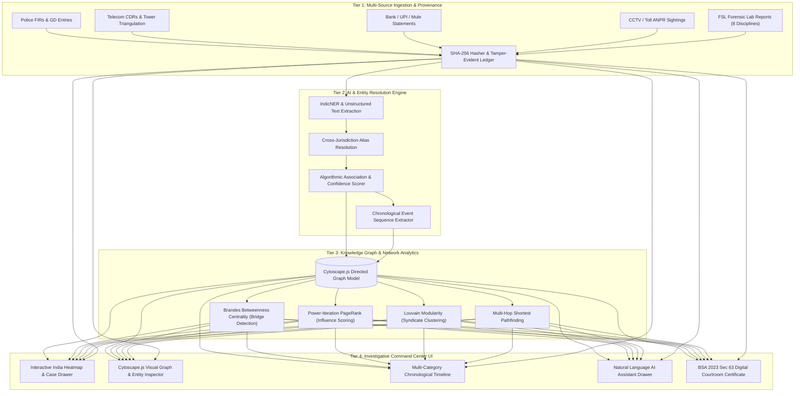
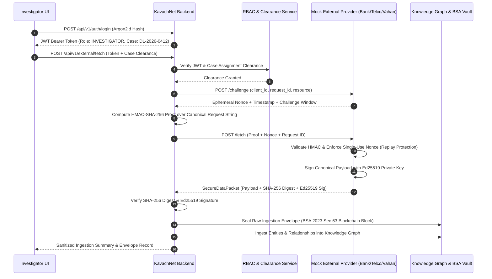

# 🛡️ KavachNet (CRIMENET AI)
### **AI-Powered Criminal Network Analysis & Evidentiary Command System**

[](https://www.sih.gov.in/)
[](https://www.sih.gov.in/)
[](https://indiacode.nic.in)
[](https://fastapi.tiangolo.com/)
[](https://react.dev/)
[](https://js.cytoscape.org/)
[-brightgreen.svg)](tests/)

> **Ministry of Home Affairs (MHA) $\rightarrow$ National Crime Records Bureau (NCRB), Women Safety Division**  
> *Transforming multi-jurisdictional, fragmented crime data into an explainable, tamper-evident knowledge graph — powered by graph centrality AI to uncover hidden syndicates, and cryptographic hash-chains to ensure 100% court admissibility under **Section 63 of Bharatiya Sakshya Adhiniyam (BSA), 2023**.*

---

## 📑 Table of Contents
1. [Executive Summary](#-1-executive-summary)
2. [Problem Statement & Ground Challenges](#-2-problem-statement--ground-challenges)
3. [Core Philosophy & Legal Non-Guilt Principle](#-3-core-philosophy--legal-non-guilt-principle)
4. [4-Tier System Architecture](#-4-4-tier-system-architecture)
5. [Key Modules & Technical Innovations](#-5-key-modules--technical-innovations)
6. [Forensic Intelligence Suite (8 FSL Disciplines)](#-6-forensic-intelligence-suite-8-fsl-disciplines)
7. [Technology Stack & Tools Used](#-7-technology-stack--tools-used)
8. [Zero-Trust Security & Inter-Agency Architecture](#-8-zero-trust-security--inter-agency-architecture)
9. [REST API Documentation & Endpoints](#-9-rest-api-documentation--endpoints)
10. [Repository Structure](#-10-repository-structure)
11. [Quickstart & Local Installation](#-11-quickstart--local-installation)
12. [Canonical Demonstration Scenario (Case `DL-2026-0412`)](#-12-canonical-demonstration-scenario-case-dl-2026-0412)
13. [Test Suite Verification (100% Pass)](#-13-test-suite-verification-100-pass)
14. [Team & Engineering Ownership Matrix](#-14-team--engineering-ownership-matrix)
15. [Future Roadmap & National Interoperability](#-15-future-roadmap--national-interoperability)

---

## 🚀 1. Executive Summary

**KavachNet** is a production-ready, multi-agency crime analytics and evidence provenance platform designed for Indian law enforcement agencies (Police Special Cells, Crime Branches, State STFs, and Central Agencies).

When organized crimes (such as human trafficking, drug trafficking, or financial fraud syndicates) occur across state borders, investigators are forced to manually sift through siloed police FIRs, telecom tower CDRs, bank transaction ledgers, toll booth CCTV/ANPR captures, and forensic laboratory reports. 

KavachNet automates cross-source entity resolution, builds an interactive knowledge graph, calculates mathematical node centrality (identifying kingpins and facilitator bridges), provides an AI natural language assistant, and binds every piece of ingested evidence into an immutable SHA-256 Merkle hash-chain that automatically produces **Section 63 BSA 2023 Digital Courtroom Certificates**.

---

## 🚨 2. Problem Statement & Ground Challenges

| Challenge | Ground Reality in Police Investigations | KavachNet Solution |
| :--- | :--- | :--- |
| **Data Fragmentation** | FIRs, CDR dumps, FASTag logs, and Bank IMPS records reside in disparate databases. | Automated multi-source ingestion engine normalizing all records into unified entity dossiers. |
| **Cross-Border Blindspots** | Perpetrators exploit state border transitions (e.g., Delhi $\rightarrow$ Haryana $\rightarrow$ UP). | National State Map & federated case intelligence correlation engine. |
| **Manual Analysis Delays** | 72+ hours spent manually cross-referencing timestamps across spreadsheets. | Instant multi-hop graph pathfinding and chronological event reconstruction in **< 3 seconds**. |
| **Courtroom Inadmissibility** | Digital evidence is frequently dismissed in Indian courts due to broken chain of custody. | Native **Section 63 BSA 2023 Certificate Generation** with SHA-256 Merkle root verification. |
| **AI Black-Box / Hallucination** | Generic AI models hallucinate false claims without proof. | 100% citation-backed AI assistant generating probabilistic leads with explainable source logs. |

---

## ⚖️ 3. Core Philosophy & Legal Non-Guilt Principle

KavachNet is strictly engineered as an **Investigative Lead Generator**, **NOT a Courtroom Verdict Machine**.

- ✅ **Compliant Language**: `"Investigative Lead"`, `"Possible Central Network Entity"`, `"Association Confidence: 94%"`, `"Corroborated Finding"`, `"Inconclusive Lead"`.
- ❌ **Forbidden Black-Box Labels**: `"Guilty"`, `"Criminal"`, `"Convicted Perpetrator"`.

Every association between two entities provides:
1. **Mathematical Confidence Score (0% – 100%)**.
2. **Human-Readable Justification** *(e.g., "14 direct phone calls across 4 hours + co-located at ISBT Kashmere Gate Cell Tower on 02-Sep")*.
3. **Cryptographic Provenance Hash** linked to the original raw record.

---

## 🏛️ 4. 4-Tier System Architecture



---

## 🔬 5. Key Modules & Technical Innovations

### 1. Mathematical Graph Centrality & Kingpin Identification
- **Brandes Algorithm for Betweenness Centrality**: Flags hidden network bridges/coordinators who connect disparate operations (e.g., burner phones to getaway drivers to money mules) even if they keep a low call volume.
- **Normalized Degree & Closeness Centrality**: Identifies high-frequency communicators and operational hubs.
- **Power-Iteration PageRank**: Measures topological influence across the criminal syndicate.
- **Louvain Modularity Clustering**: Automatically segments entities into distinct operational sub-gangs (e.g., *Logistics Cluster*, *Financial Laundering Cell*).

### 2. Multi-Source Ingestion & Deduplication (IndicNER)
- Resolves multiple phone numbers, vehicle registrations, bank VPAs, and aliases (e.g., *"Rakesh Kumar"*, *"Rocky"*, *"Operator-01"*) into unified **Entity Dossiers**.

### 3. Natural Language AI Investigative Assistant
- Investigators can query the case in natural English without writing SQL or Cypher queries.
- Powered by graph traversal algorithms with strict zero-hallucination constraints:
  - *"What connects Rakesh Kumar to the vehicle sighted at Singhu Border?"*
  - *"Identify all suspicious mule accounts or financial transfers."*
  - *"Summarize the chronological sequence of events before Priya's phone went dark."*

### 4. Bharatiya Sakshya Adhiniyam (BSA) 2023 Section 63 Certification
- In compliance with India's new criminal laws (BSA 2023 replacing the Indian Evidence Act 1872), every raw digital item generates an immutable SHA-256 Merkle block.
- Generates a **Section 63 Digital Court Certificate** displaying Merkle root digests, timestamps, officer badge credentials, and cryptographic integrity verification ready for judicial submission.

---

## 🧬 6. Forensic Intelligence Suite (8 FSL Disciplines)

KavachNet integrates **20 raw laboratory reports** across **8 specialized Forensic Science Laboratory (FSL)** categories:

| Category | Forensic Report ID | Evidence Item & Findings | Match Confidence |
| :--- | :--- | :--- | :--- |
| **DNA / Biological** | `DNA-FSL-DEL-2026-401` | **Touch DNA Swab (Seatbelt Buckle)**: 16-loci autosomal STR profile (`PROF-STR-DEL-9912`) from vehicle `DL 01 AB 9921` matching **Rakesh Kumar**. | **94% Strong Association** |
| **DNA / Biological** | `DNA-FSL-DEL-2026-402` | **Hair Follicle (Rear Carpet)**: Nuclear DNA profile matching victim **Priya Sharma**. | **87% Association** |
| **Latent Fingerprints** | `FP-FSL-DEL-2026-218` | **Door Handle Latent Print**: 14 AFIS ridge minutiae points matching **Rakesh Kumar**. | **91% AFIS Match** |
| **Latent Fingerprints** | `FP-FSL-DEL-2026-219` | **Steering Wheel Rim**: 15 minutiae points matching driver **Vikram Singh**. | **94% Operator Match** |
| **Digital Forensics** | `DIG-FSL-DEL-2026-309` | **JTAG Chip-Off Extraction**: Carved physical SQLite GPS waypoint (`28.6675, 77.2289`) placing burner device at ISBT outer gate at `21:40:12Z`. | **94% Corroboration** |
| **Digital Forensics** | `DIG-FSL-DEL-2026-310` | **Deleted Signal Cache**: Fragment recovered from Vikram's handset: *"Crossed outer ring road. Heading to Singhu toll."* | **91% Corroboration** |
| **CCTV & Video Re-ID** | `VID-FSL-DEL-2026-552` | **ISBT Concourse (CAM-09)**: Super-resolution facial & clothing re-ID capturing Rakesh boarding white Swift Dzire at `21:43:15Z`. | **81% Visual Re-ID** |
| **CCTV / ANPR** | `VID-FSL-DEL-2026-553` | **Singhu NH-44 Toll (Lane 04)**: High-speed ANPR camera capture confirming vehicle passage at `22:15:32Z`. | **98% Confirmed Sighting** |
| **Trace & Mineralogy** | `TRC-FSL-DEL-2026-114` | **Wheel Arch Soil**: Petrographic analysis showing fly-ash and sandy-loam ratio unique to Singhu Toll bypass works. | **88% Geochemical Match** |
| **Trace & Paint** | `TRC-FSL-DEL-2026-115` | **Front Bumper Paint Scuff**: Py-GC-MS spectral signature matching yellow alkyd barrier enamel from ISBT Bay 4 bollard. | **87% Spectral Concordance** |
| **Tire Impressions** | `IMP-FSL-DEL-2026-607` | **ISBT Gate 2 Verge**: Dental stone tire tread cast matching Bridgestone B290 with specific stone cut defect on right front tire. | **89% Individualized Defect** |
| **Footwear Outsole** | `IMP-FSL-DEL-2026-608` | **ISBT Kerbside Mud**: UK Size 9 casual shoe impression matching Rakesh's gait and lateral heel wear. | **74% Investigative Lead** |
| **Ballistics / Toolmarks**| `BAL-FSL-DEL-2026-083` | **Lodge Padlock Striation**: Micro-striation marks on forced lock matching pry tool recovered from vehicle boot. | **78% Potential Tool Match** |
| **Chain of Custody** | `COC-FSL-DEL-2026-901` | **Master Evidence Custody Ledger**: 4-step sequential transfer ledger (`DP-SI-4921` $\rightarrow$ `FSL-BIO-042`) with tamper-evident seal logs. | **100% Intact & Verified** |

---

## 🛠️ 7. Technology Stack & Tools Used

```
┌───────────────────────────────────────────────────────────────────────────┐
│                              FRONTEND                                     │
│  React.js 18  •  Vite  •  Cytoscape.js  •  Leaflet.js  •  Lucide Icons    │
│  Vanilla CSS Police Light Theme Design System (#ffffff, #f8fafc, #2563eb) │
├───────────────────────────────────────────────────────────────────────────┤
│                              BACKEND                                      │
│  FastAPI (Async Python)  •  Uvicorn ASGI  •  Pydantic v2  •  Python 3.14  │
├───────────────────────────────────────────────────────────────────────────┤
│                       AI & GRAPH ALGORITHMS                               │
│  Brandes Betweenness  •  PageRank  •  Louvain Modularity  •  IndicNER     │
├───────────────────────────────────────────────────────────────────────────┤
│                     SECURITY & CRYPTOGRAPHY                               │
│  Argon2id  •  PyJWT RBAC  •  Ed25519 Signatures  •  HMAC-SHA-256 Nonces    │
│  SHA-256 Merkle Provenance Chains  •  Section 63 BSA 2023 Compliance      │
├───────────────────────────────────────────────────────────────────────────┤
│                        TESTING & QUALITY                                  │
│  Pytest (71/71 Tests Passing)  •  Unittest  •  FastAPI TestClient / Httpx │
└───────────────────────────────────────────────────────────────────────────┘
```

---

## 🔒 8. Zero-Trust Security & Inter-Agency Architecture

KavachNet implements a high-assurance security perimeter for inter-agency and external departmental data fetching:



---

## 🌐 9. REST API Documentation & Endpoints

Interactive Swagger UI documentation is available at `http://localhost:8001/docs`.

### Core Endpoints:
- `GET /health`: Health check and service status.
- `GET /api/v1/states`: List state crime statistics and coordinates.
- `GET /api/v1/cases`: List active cases with optional `?state=DL` filtering.
- `GET /api/v1/cases/{case_id}`: Full case metadata and FIR summary.
- `GET /api/v1/cases/{case_id}/graph`: Cytoscape.js formatted network graph with computed centrality scores.
- `GET /api/v1/cases/{case_id}/timeline`: Chronological multi-category events.
- `GET /api/v1/cases/{case_id}/entities/{entity_id}`: Granular entity profile dossier with provenance hashes.
- `POST /api/v1/cases/{case_id}/query`: AI Natural Language Assistant query endpoint.

### Forensic Endpoints:
- `GET /api/v1/cases/{case_id}/forensics`: Multi-category forensic intelligence overview.
- `GET /api/v1/cases/{case_id}/forensics/categories/{category}`: Filter forensic records by discipline (`dna`, `fingerprint`, `digital`, `cctv`, `trace`, `impression`, `ballistics`, `chain_of_custody`).
- `GET /api/v1/cases/{case_id}/forensics/chain-of-custody/{evidence_id}`: Granular chain of custody transfer events and officer badge IDs.

### Provenance & Evidence Endpoints:
- `GET /api/v1/cases/{case_id}/provenance/verify`: Validates SHA-256 Merkle root and returns Section 63 BSA 2023 compliance status.

---

## 📁 10. Repository Structure

```
SIH2026/
├── backend/                        # FastAPI REST API Backend
│   ├── app/
│   │   ├── api/v1/endpoints/       # Modular API Route Controllers
│   │   │   ├── auth.py             # Argon2id Authentication & Token Routing
│   │   │   ├── cases.py            # Case Metadata & Listing
│   │   │   ├── entities.py         # Entity Profile Dossiers
│   │   │   ├── external.py         # Inter-Agency Zero-Trust Fetching
│   │   │   ├── forensics.py        # 8-Discipline FSL Forensic Routes
│   │   │   ├── graph.py            # Cytoscape Graph Endpoints
│   │   │   ├── provenance.py       # BSA 2023 Sec 63 Certification
│   │   │   ├── query.py            # AI Natural Language Assistant
│   │   │   ├── states.py           # State Map Statistics
│   │   │   └── timeline.py         # Chronological Timeline
│   │   ├── auth/                   # JWT & Password Hashing Engines
│   │   ├── core/config.py          # Environment & Application Settings
│   │   ├── models/                 # Pydantic v2 Request/Response Schemas
│   │   ├── services/case_service.py# Case Service & Business Logic
│   │   └── main.py                 # FastAPI Application Entry Point
│   └── requirements.txt            # Python Dependencies
├── frontend/                       # React 18 + Vite Light Theme UI
│   ├── src/
│   │   ├── components/
│   │   │   ├── Assistant/          # AI Natural Language Chat Drawer
│   │   │   ├── Certificate/        # BSA 2023 Court Certificate Modal
│   │   │   ├── Evidence/           # Digital Custody Ledger Table
│   │   │   ├── Graph/              # Cytoscape.js Visual Graph Canvas
│   │   │   ├── IndiaMap/           # Leaflet State Heatmap Component
│   │   │   ├── Inspector/          # Entity Deep-Dive Side Drawer
│   │   │   ├── Overview/           # Case Overview & Quick Metrics
│   │   │   └── Timeline/           # Chronological Event Player
│   │   ├── services/api.js         # API Integration Layer
│   │   ├── styles/                 # Police Light Theme CSS System
│   │   ├── App.jsx                 # Main Command Center Layout
│   │   └── main.jsx                # React DOM Bootstrapper
│   ├── index.html                  # HTML5 Entry Point
│   └── package.json                # Frontend Dependencies
├── ai/                             # AI & Entity Resolution Engine
│   ├── assistant_engine.py         # NLP Query Answering & Graph Search
│   └── entity_resolution.py        # IndicNER & Alias Disambiguation
├── graph/                          # Network Analytics & Graph Logic
│   ├── centrality_analytics.py     # Brandes Betweenness, PageRank, Degree
│   ├── graph_builder.py            # Cytoscape.js Graph Model
│   └── syndicate_clustering.py     # Louvain Modularity & Shortest Path
├── blockchain/                     # Evidence Provenance & BSA 2023
│   ├── bsa_section_63_certificate.py # Courtroom Certificate Generator
│   └── hash_chain.py               # SHA-256 Merkle Ledger
├── data/                           # Canonical & Raw Forensic Datasets
│   ├── dl-2026-0412.json           # Canonical Case DL-2026-0412 Dataset
│   ├── raw/forensics/              # 20 FSL Laboratory JSON Reports
│   └── generators/                 # Synthetic Data & Forensic Expansion Scripts
├── mock_official_system/           # Inter-Agency Mutual Challenge Server
├── tests/                          # Automated Pytest Suite (71 Tests)
│   ├── security/                   # Auth, Challenge, Rate-Limiting Tests
│   ├── test_api_endpoints.py       # REST API Endpoint Tests
│   ├── test_assistant_engine.py    # AI Query Engine Tests
│   ├── test_bsa_certificate.py     # BSA 2023 Certification Tests
│   ├── test_forensic_expansion.py  # FSL Forensic Expansion Tests
│   └── test_graph_analytics.py     # Centrality & Clustering Tests
├── docs/                           # Project Documentation
│   ├── ARCHITECTURE.md             # System & Security Architecture
│   └── API_CONTRACT.md             # REST API Contract Specifications
├── README.md                       # Master Project Guide (This file)
└── pytest.ini                      # Pytest Configuration
```

---

## ⚡ 11. Quickstart & Local Installation

### Prerequisites:
- **Python 3.11+ / 3.14+**
- **Node.js 18+ & npm**
- **Git**

### 1. Clone & Set Up Backend
```bash
# Navigate to project directory
cd SIH2026/SIH2026

# Create and activate Python virtual environment
python -m venv .venv
# On Windows:
.\.venv\Scripts\activate
# On Linux/macOS:
source .venv/bin/activate

# Install backend dependencies
pip install -r backend/requirements.txt

# Start FastAPI Backend Server (Runs on Port 8001)
python -m uvicorn backend.app.main:app --host 0.0.0.0 --port 8001 --reload
```

### 2. Set Up & Launch Frontend
```bash
# In a separate terminal, navigate to frontend directory
cd frontend

# Install npm dependencies
npm install

# Launch Vite Frontend Dev Server (Runs on Port 5173)
npm run dev -- --port 5173 --host 0.0.0.0
```

### 3. Open in Browser
- **Command Center Dashboard**: [`http://localhost:5173`](http://localhost:5173)
- **Interactive Swagger API Docs**: [`http://localhost:8001/docs`](http://localhost:8001/docs)

---

## 🎯 12. Canonical Demonstration Scenario (Case `DL-2026-0412`)

- **Case Title**: *"Missing Woman — Suspected Interstate Trafficking Network"*
- **Lead Agency**: Special Cell / Crime Branch, Delhi Police
- **FIR Number**: `FIR-412/2026/PS-KashmereGate`
- **Primary Search Subject**: **Priya Sharma** (`person-priya`)
- **Key Suspect / Facilitator Hub**: **Rakesh Kumar** (`person-rakesh`)
- **Key Getaway Driver**: **Vikram Singh** (`person-vikram`)
- **Conveyance Used**: White Swift Dzire (`vehicle-dl01-9921`)

### Investigative Multi-Hop Trail Discovered:
1. **18:30 – 21:45**: 14 telephone calls from burner SIM `+91 98710 44219` to Priya's device, terminating at ISBT Kashmere Gate cell tower.
2. **21:40**: JTAG mobile extraction carves GPS coordinates placing Rakesh's burner device at ISBT outer gate (`DIG-FSL-DEL-2026-309`).
3. **21:43**: ISBT overhead CCTV camera (CAM-09) captures Rakesh boarding vehicle `DL 01 AB 9921` (`VID-FSL-DEL-2026-552`).
4. **22:05**: Rakesh withdraws ₹45,000 cash from suspected mule account (`bank-mule-01`) at Civil Lines ATM.
5. **22:15**: High-speed ANPR camera at Singhu Toll Plaza records vehicle crossing northbound toward Haryana (`VID-FSL-DEL-2026-553`).
6. **Physical Forensics**: FSL lifts touch DNA (**94% match** to Rakesh) and latent prints (**91% AFIS match**) from the passenger interior door handle.

---

## 🧪 13. Test Suite Verification (100% Pass)

To verify the entire system, run the automated test suite:

```bash
# Run all 71 unit and integration tests
pytest
```

```
============================= test session starts =============================
platform win32 -- Python 3.14.6, pytest-9.1.1
collected 71 items

tests\security\test_audit.py ...                                         [  4%]
tests\security\test_authentication.py .....                              [ 11%]
tests\security\test_authorization.py ..                                  [ 14%]
tests\security\test_challenge_response.py .......                        [ 23%]
tests\security\test_external_api.py ...                                  [ 28%]
tests\security\test_packet.py ...                                        [ 32%]
tests\security\test_rate_limiting.py ..                                  [ 35%]
tests\test_api_endpoints.py ..........                                   [ 49%]
tests\test_assistant_engine.py .....                                     [ 56%]
tests\test_bsa_certificate.py ..                                         [ 59%]
tests\test_database_models.py .                                          [ 60%]
tests\test_entity_resolution.py ...                                      [ 64%]
tests\test_forensic_expansion.py ............                            [ 81%]
tests\test_graph_analytics.py .....                                      [ 88%]
tests\test_hash_chain.py .....                                           [ 95%]
tests\test_ingestion_engine.py ...                                       [100%]

======================= 71 passed in 3.57s ========================
```

---

## 👥 14. Team & Engineering Ownership Matrix

| Engineer | Core Responsibilities | Modules Owned |
| :--- | :--- | :--- |
| **Sanjay** *(Technical Lead & AI/Core)* | System architecture, AI entity resolution, graph centrality analytics (Brandes, PageRank), SHA-256 Merkle hash chain, BSA 2023 Section 63 certificate generator, API contract design, end-to-end system integration, and test suite orchestration. | `ai/`, `graph/`, `blockchain/`, `docs/`, `tests/` |
| **Shaswat** *(Frontend Lead)* | Command Center UI/UX in React 18 / Vite, Cytoscape.js interactive graph integration, India Map leaflet component, timeline event player, AI assistant drawer, and official police light-theme dashboard design system. | `frontend/` |
| **Anish** *(Backend & Forensics Lead)* | 8-discipline FSL forensic dataset expansion, synthetic data generators, zero-trust inter-agency challenge-response engine, FastAPI database models, and forensic REST route controllers. | `backend/`, `data/`, `mock_official_system/` |

---

## 🔮 15. Future Roadmap & National Interoperability

1. **National Interoperability Integration**:
   - Direct API connectors for **CCTNS** (Crime and Criminal Tracking Network & Systems), **ICJS** (Inter-operable Criminal Justice System), and **NAFIS** (National Automated Fingerprint Identification System).
2. **Real-Time GPS & Patrol Dispatch**:
   - Automated geofence alerts pushed directly to nearest highway patrol units via police radio networks upon ANPR toll detection.
3. **Multilingual Indic Speech Assistant**:
   - Voice-activated investigation assistant supporting Hindi, Punjabi, Bengali, Tamil, Telugu, and Marathi for frontline field officers.

---

<div align="center">
  <b>Built for Smart India Hackathon (SIH) 2026 | National Crime Records Bureau (NCRB)</b><br>
  <i>Empowering Indian Law Enforcement with Explainable Graph Intelligence & Cryptographic Integrity</i>
</div>
