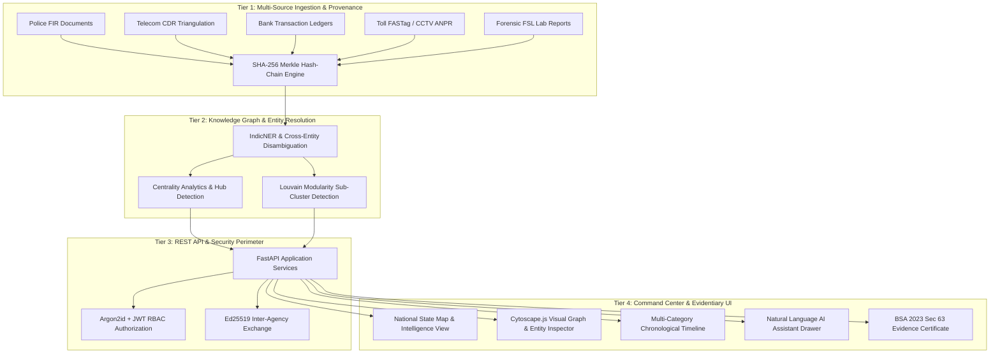
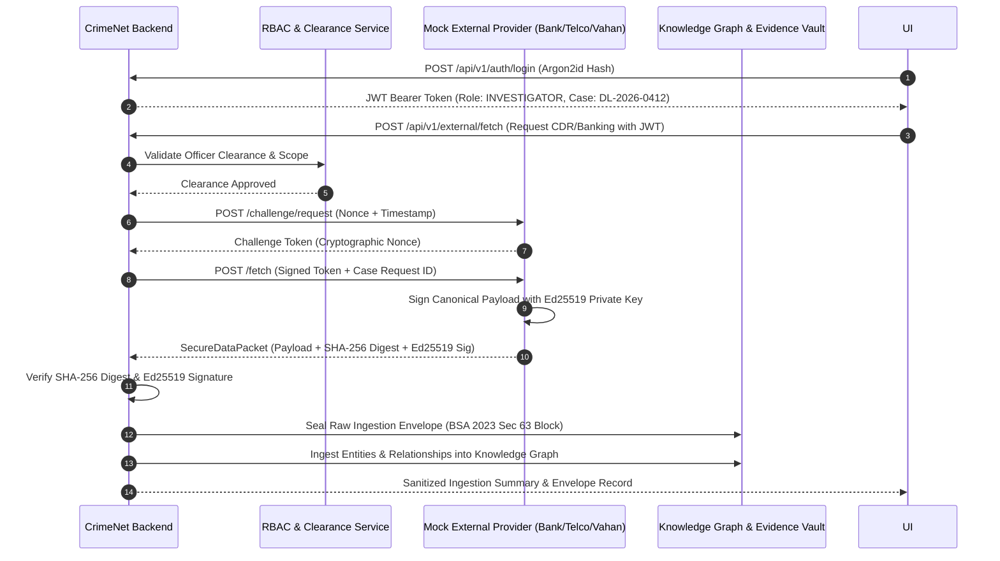

# 🛡️ VIDUR — CrimeNet
### **AI-Powered Criminal Network Analysis & Evidentiary Command System**

[](https://www.sih.gov.in/)
[](https://www.sih.gov.in/)
[](https://indiacode.nic.in)
[](https://fastapi.tiangolo.com/)
[](https://react.dev/)
[](https://js.cytoscape.org/)
[](tests/)

> **Ministry of Home Affairs (MHA) → National Crime Records Bureau (NCRB), Women Safety Division**
> *A prototype that turns fragmented, multi-jurisdictional crime data into an explainable, tamper-evident knowledge graph — using graph centrality algorithms to surface hidden network structure, and a cryptographic hash-chain to help evidence integrity hold up under **Section 63 of the Bharatiya Sakshya Adhiniyam (BSA), 2023**.*

> **⚠️ All case data in this repository — names, phone numbers, forensic matches, bank transactions, and the case `DL-2026-0412` itself — is entirely synthetic and fictional, generated for demonstration purposes only. Nothing here describes a real person, a real investigation, or real evidence.**

---

## 📑 Table of Contents
1. [Executive Summary](#1-executive-summary)
2. [Problem Statement & Ground Challenges](#2-problem-statement--ground-challenges)
3. [Core Philosophy & Legal Non-Guilt Principle](#3-core-philosophy--legal-non-guilt-principle)
4. [4-Tier System Architecture](#4-4-tier-system-architecture)
5. [Key Modules & Technical Innovations](#5-key-modules--technical-innovations)
6. [Forensic Intelligence Suite (8 FSL Disciplines)](#6-forensic-intelligence-suite-8-fsl-disciplines)
7. [Technology Stack & Tools Used](#7-technology-stack--tools-used)
8. [Zero-Trust Security & Inter-Agency Architecture](#8-zero-trust-security--inter-agency-architecture)
9. [REST API Documentation & Endpoints](#9-rest-api-documentation--endpoints)
10. [Repository Structure](#10-repository-structure)
11. [Quickstart & Local Installation](#11-quickstart--local-installation)
12. [Canonical Demonstration Scenario (Case `DL-2026-0412`)](#12-canonical-demonstration-scenario-case-dl-2026-0412)
13. [Test Suite Verification](#13-test-suite-verification)
14. [Team & Engineering Ownership Matrix](#14-team--engineering-ownership-matrix)
15. [Future Roadmap & National Interoperability](#15-future-roadmap--national-interoperability)

---

## 🚀 1. Executive Summary

**VIDUR** is a crime analytics and evidence-provenance prototype, built under the product name **CrimeNet**, for Indian law-enforcement investigative workflows (Police Special Cells, Crime Branches, State STFs, and Central Agencies).

When organized crimes — human trafficking, financial fraud syndicates, narcotics networks — span state borders, investigators have to manually cross-reference siloed FIRs, telecom CDRs, bank transaction ledgers, CCTV/ANPR captures, and forensic lab reports by hand.

CrimeNet automates cross-source entity resolution, builds an interactive knowledge graph, computes graph centrality (surfacing likely hubs and bridge entities), provides a natural-language investigative assistant, and hashes every piece of ingested evidence into a SHA-256 Merkle chain that produces a **BSA 2023 Section 63 evidence-documentation certificate** for each item.

This is a **hackathon prototype demonstrating the approach**, not a fielded government system — see [§15](#15-future-roadmap--national-interoperability) for what real deployment would require.

---

## ⚖️ 2. Problem Statement & Ground Challenges

| Challenge | Ground Reality in Police Investigations | CrimeNet's Approach |
| :--- | :--- | :--- |
| **Data Fragmentation** | FIRs, CDR dumps, FASTag logs, and bank records sit in disparate databases. | An ingestion layer that normalizes multi-source records into unified entity dossiers. |
| **Cross-Border Blindspots** | Perpetrators exploit state-border transitions (e.g., Delhi → Haryana → UP). | A national state map and cross-case correlation view. |
| **Manual Analysis Delays** | Investigators can spend a long time manually cross-referencing timestamps across spreadsheets. | Automated multi-hop graph pathfinding and chronological event reconstruction. |
| **Evidentiary Chain-of-Custody Gaps** | Digital evidence has been thrown out in Indian courts over broken chain-of-custody. | A SHA-256 Merkle hash-chain and a BSA 2023 §63-aligned certificate generator, intended to *support* documentation — not a substitute for lawful acquisition and judicial evaluation. |
| **AI Black-Box Risk** | Generic AI assistants can state things with no traceable source. | Every assistant answer is grounded in the case graph and cites the evidence/relationships behind it. |

---

## 🧠 3. Core Philosophy & Legal Non-Guilt Principle

CrimeNet is built strictly as an **investigative lead-generation tool — not a verdict machine.**

- ✅ **Language it uses**: `"Investigative Lead"`, `"Possible Central Network Entity"`, `"Association Confidence: 94%"`, `"Corroborated Finding"`, `"Inconclusive Lead"`.
- ❌ **Language it never uses**: `"Guilty"`, `"Criminal"`, `"Convicted Perpetrator"`, or anything phrased as a legal conclusion.

Every association between two entities is shown with:
1. A confidence score (0–100%), never presented as certainty.
2. A human-readable justification (e.g., *"14 phone calls across 4 hours + co-located at the same cell tower on a given date"*).
3. A provenance hash linking back to the original raw record.

This isn't just a style choice — it's what makes the system's output something an investigator can actually act on and defend, rather than a black-box score.

---

## 🏗️ 4. 4-Tier System Architecture



---

## 🔬 5. Key Modules & Technical Innovations

### 1. Graph Centrality & Key-Entity Identification
- **Brandes algorithm (betweenness centrality)**: surfaces entities that structurally bridge otherwise-separate parts of a network — potential coordinators or connectors, even at low individual call/transaction volume.
- **Degree centrality**: highlights high-frequency communicators and operational hubs.
- **Power-iteration PageRank**: measures topological influence across the network, not just raw connection count.
- **Louvain modularity clustering**: groups entities into likely sub-clusters (e.g., a logistics cluster vs. a financial cluster) for the investigator to examine — a structural signal, not a confirmed grouping.

### 2. Multi-Source Ingestion & Entity Resolution (IndicNER)
Resolves phone numbers, vehicle registrations, bank identifiers, and name aliases into unified entity dossiers.

### 3. Natural-Language Investigative Assistant
Investigators can query the case graph in plain English instead of writing queries directly, e.g.:
- *"What connects this person to the vehicle sighted at the border checkpoint?"*
- *"List transactions flagged as unusual for this case."*
- *"Summarize the event sequence leading up to the last known contact."*

Every answer is grounded in the case's own graph/evidence data — it does not introduce facts that aren't present in the case.

### 4. Bharatiya Sakshya Adhiniyam (BSA) 2023, Section 63 — Documentation Support
For each ingested digital item, the system generates a SHA-256 Merkle block and a certificate recording hash digests, timestamps, and handling metadata — intended to **support** the documentation Section 63 requires for electronic evidence. This assists with evidentiary documentation; it does not itself determine legal admissibility, which remains a matter of lawful acquisition, proper handling, and judicial evaluation.

---

## 🧬 6. Forensic Intelligence Suite (8 FSL Disciplines)

*(All entries below are synthetic demo records tied to the fictional case `DL-2026-0412` — see the disclaimer at the top of this document.)*

CrimeNet's synthetic dataset spans 8 forensic categories to demonstrate cross-discipline correlation: DNA/biological, latent fingerprints, digital forensics, CCTV/video, trace & mineralogy, tire/footwear impressions, ballistics/toolmarks, and chain-of-custody records. Each record carries a category, a fabricated match-confidence figure, and a plain-language finding, so the graph and timeline views have realistic, varied evidence to correlate against. Full sample data lives in `data/dl-2026-0412.json` and `data/raw/forensics/`.

---

## 🛠️ 7. Technology Stack & Tools Used

```
┌───────────────────────────────────────────────────────────────────────────┐
│                              FRONTEND                                     │
│  React.js 18  •  Vite  •  Cytoscape.js  •  Leaflet.js  •  Lucide Icons    │
│  Vanilla CSS design system (light, government-dashboard style)            │
├───────────────────────────────────────────────────────────────────────────┤
│                              BACKEND                                      │
│  FastAPI (Async Python)  •  Uvicorn ASGI  •  Pydantic v2  •  Python 3.14  │
│  NetworkX  •  Scikit-Learn  •  Argon2id  •  Cryptography (PyCA)           │
├───────────────────────────────────────────────────────────────────────────┤
│                     SECURITY & CRYPTOGRAPHY                               │
│  Argon2id  •  PyJWT RBAC  •  Ed25519 Signatures  •  HMAC-SHA-256 Nonces    │
│  SHA-256 Merkle Provenance Chains  •  BSA 2023 Section 63 alignment       │
├───────────────────────────────────────────────────────────────────────────┤
│                        TESTING & QUALITY                                  │
│  Pytest (71/71 tests passing)  •  FastAPI TestClient / Httpx              │
└───────────────────────────────────────────────────────────────────────────┘
```

---

## 🔒 8. Zero-Trust Security & Inter-Agency Architecture



This mock inter-agency exchange (`mock_official_system/`) exists to demonstrate the security pattern the architecture is designed around — it is a simulated external provider, not a connection to any real government or telecom system.

---

## 🌐 9. REST API Documentation & Endpoints

Interactive Swagger UI documentation is available at `http://localhost:8001/docs` once the backend is running.

### Core Endpoints
- `GET /health` — Health check and service status.
- `GET /api/v1/states` — State-level crime statistics and coordinates.
- `GET /api/v1/cases` — List active cases, optionally filtered by `?state=DL`.
- `GET /api/v1/cases/{case_id}` — Full case metadata and FIR summary.
- `GET /api/v1/cases/{case_id}/graph` — Cytoscape.js-formatted network graph with computed centrality scores.
- `GET /api/v1/cases/{case_id}/timeline` — Chronological, multi-category events.
- `GET /api/v1/cases/{case_id}/entities/{entity_id}` — Entity profile with provenance hashes.
- `POST /api/v1/cases/{case_id}/query` — Natural-language assistant query endpoint.

### Forensic Endpoints
- `GET /api/v1/cases/{case_id}/forensics` — Multi-category forensic overview.
- `GET /api/v1/cases/{case_id}/forensics/categories/{category}` — Filter by discipline (`dna`, `fingerprint`, `digital`, `cctv`, `trace`, `impression`, `ballistics`, `chain_of_custody`).
- `GET /api/v1/cases/{case_id}/forensics/chain-of-custody/{evidence_id}` — Chain-of-custody transfer events.

### Provenance & Evidence Endpoints
- `GET /api/v1/cases/{case_id}/provenance/verify` — Validates the SHA-256 Merkle root and reports BSA 2023 §63-alignment status.

---

## 🗂️ 10. Repository Structure

```
SIH2026/
├── .antigravity/                    # Internal AI pair-programming instructions
│                                    # (agent role files, dev prompts — not required to run or evaluate the project)
├── backend/                        # FastAPI REST API backend
│   ├── app/
│   │   ├── api/v1/endpoints/       # Modular API route controllers
│   │   │   ├── auth.py             # Argon2id authentication & token routing
│   │   │   ├── cases.py            # Case metadata & listing
│   │   │   ├── entities.py         # Entity profile dossiers
│   │   │   ├── external.py         # Inter-agency zero-trust fetching
│   │   │   ├── forensics.py        # 8-discipline FSL forensic routes
│   │   │   ├── graph.py            # Cytoscape graph endpoints
│   │   │   ├── provenance.py       # BSA 2023 Sec 63 certification
│   │   │   ├── query.py            # AI natural-language assistant
│   │   │   ├── states.py           # State map statistics
│   │   │   └── timeline.py         # Chronological timeline
│   │   ├── auth/                   # JWT & password-hashing engines
│   │   ├── core/config.py          # Environment & application settings
│   │   ├── models/                 # Pydantic v2 request/response schemas
│   │   ├── services/case_service.py# Case service & business logic
│   │   └── main.py                 # FastAPI application entry point
│   └── requirements.txt            # Python dependencies
├── frontend/                       # React 18 + Vite investigator UI
│   ├── src/
│   │   ├── components/
│   │   │   ├── Assistant/          # AI natural-language chat drawer
│   │   │   ├── Certificate/        # BSA 2023 evidence certificate modal
│   │   │   ├── Evidence/           # Digital custody ledger table
│   │   │   ├── Graph/              # Cytoscape.js visual graph canvas
│   │   │   ├── IndiaMap/           # Leaflet state heatmap component
│   │   │   ├── Inspector/          # Entity deep-dive side drawer
│   │   │   ├── Overview/           # Case overview & quick metrics
│   │   │   └── Timeline/           # Chronological event player
│   │   ├── services/api.js         # API integration layer
│   │   ├── styles/                 # Light-theme CSS system
│   │   ├── App.jsx                 # Main command-center layout
│   │   └── main.jsx                # React DOM bootstrapper
│   ├── index.html                  # HTML5 entry point
│   └── package.json                # Frontend dependencies
├── ai/                              # AI & entity-resolution engine
│   ├── assistant_engine.py         # NLP query answering & graph search
│   └── entity_resolution.py        # IndicNER & alias disambiguation
├── graph/                           # Network analytics & graph logic
│   ├── centrality_analytics.py     # Brandes betweenness, PageRank, degree
│   ├── graph_builder.py            # Cytoscape.js graph model
│   └── syndicate_clustering.py     # Louvain modularity & shortest path
├── blockchain/                      # Evidence provenance & BSA 2023
│   ├── bsa_certificate.py          # Evidence certificate generator
│   └── hash_chain.py               # SHA-256 Merkle ledger
├── data/                            # Canonical & raw synthetic datasets
│   ├── dl-2026-0412.json           # Canonical (fictional) case dataset
│   ├── raw/forensics/              # Synthetic FSL laboratory records
│   └── generators/                 # Synthetic data generation scripts
├── mock_official_system/           # Simulated inter-agency challenge server
├── tests/                           # Automated pytest suite
│   ├── security/                   # Auth, challenge, rate-limiting tests
│   ├── test_api_endpoints.py       # REST API endpoint tests
│   ├── test_assistant_engine.py    # AI query engine tests
│   ├── test_bsa_certificate.py     # BSA 2023 certification tests
│   ├── test_forensic_expansion.py  # FSL forensic expansion tests
│   └── test_graph_analytics.py     # Centrality & clustering tests
├── docs/                            # Project documentation
│   ├── ARCHITECTURE.md             # System & security architecture
│   └── API_CONTRACT.md             # REST API contract specifications
├── README.md                        # This file
└── pytest.ini                       # Pytest configuration
```

---

## ⚡ 11. Quickstart & Local Installation

### Prerequisites
- **Python 3.11+**
- **Node.js 18+ & npm**
- **Git**

### 1. Clone & set up the backend
```bash
git clone https://github.com/Yamadakun101/SIH2026.git
cd SIH2026

python -m venv .venv
# Windows:
.\.venv\Scripts\activate
# Linux/macOS:
source .venv/bin/activate

pip install -r backend/requirements.txt
python -m uvicorn backend.app.main:app --host 0.0.0.0 --port 8001 --reload
```

### 2. Set up & launch the frontend
```bash
cd frontend
npm install
npm run dev -- --port 5173 --host 0.0.0.0
```

### 3. Open in browser
- **Command center dashboard**: [`http://localhost:5173`](http://localhost:5173)
- **Interactive Swagger API docs**: [`http://localhost:8001/docs`](http://localhost:8001/docs)

---

## 🎯 12. Canonical Demonstration Scenario (Case `DL-2026-0412`)

*(Fictional — see disclaimer at the top of this document. No real persons, places, or events are depicted.)*

- **Case title**: *"Missing Woman — Suspected Interstate Trafficking Network"*
- **Lead agency (fictional)**: Special Cell / Crime Branch, Delhi Police
- **FIR number (fictional)**: `FIR-412/2026/PS-KashmereGate`
- **Primary search subject**: Priya Sharma (`person-priya`)
- **Possible central network entity**: Rakesh Kumar (`person-rakesh`)
- **Associated entity**: Vikram Singh (`person-vikram`)
- **Vehicle of interest**: White Swift Dzire (`vehicle-dl01-9921`)

The synthetic dataset threads a multi-hop investigative trail through this case — phone records, a digital forensic extraction, a CCTV sighting, a financial withdrawal, an ANPR toll capture, and DNA/fingerprint matches — specifically so the demo can show entity resolution, timeline reconstruction, and graph analytics all working on one coherent, fabricated story. Full detail is in `data/dl-2026-0412.json`.

---

## 🧪 13. Test Suite Verification

```bash
pytest
```

71 automated tests currently cover the security layer (auth, challenge-response, rate limiting), the REST API endpoints, the AI assistant engine, BSA certificate generation, entity resolution, forensic-data expansion, graph analytics, and the hash chain.

---

## 👥 14. Team & Engineering Ownership Matrix

| Engineer | Core Responsibilities | Modules Owned |
| :--- | :--- | :--- |
| **Sanjay** *(Technical Lead & AI/Core)* | System architecture, AI entity resolution, graph centrality analytics, SHA-256 Merkle hash chain, BSA 2023 §63 certificate generator, API contract design, end-to-end integration, test suite. | `ai/`, `graph/`, `blockchain/`, `docs/`, `tests/` |
| **Shaswat** *(Frontend Lead)* | Command-center UI/UX in React 18/Vite, Cytoscape.js graph integration, India map component, timeline player, AI assistant drawer, design system. | `frontend/` |
| **Anish** *(Backend & Forensics Lead)* | FSL forensic dataset design, synthetic data generators, inter-agency challenge-response engine, FastAPI database models, forensic route controllers. | `backend/`, `data/`, `mock_official_system/` |

---

## 🔮 15. Future Roadmap & National Interoperability

This prototype demonstrates the intelligence/analytics approach on synthetic data. A real deployment would additionally require: formal agency authorization and data-sharing agreements, integration work with systems like **CCTNS**, **ICJS**, and **NAFIS** rather than standalone operation, privacy and security review, audit-logging and governance processes, and validation against real, authorized datasets — none of which this prototype claims to have in place yet.

Longer-term directions being considered:
1. **National interoperability** — API-level integration with CCTNS, ICJS, and NAFIS instead of a standalone system.
2. **Real-time geofence alerts** — pushing ANPR-based detections to relevant patrol units.
3. **Multilingual assistant** — voice/text support in Hindi, Punjabi, Bengali, Tamil, Telugu, and Marathi for field officers.

---

<div align="center">
  <b>Built for Smart India Hackathon (SIH) 2026 | National Crime Records Bureau (NCRB)</b><br>
  <i>Project VIDUR — product name CrimeNet</i>
</div>
