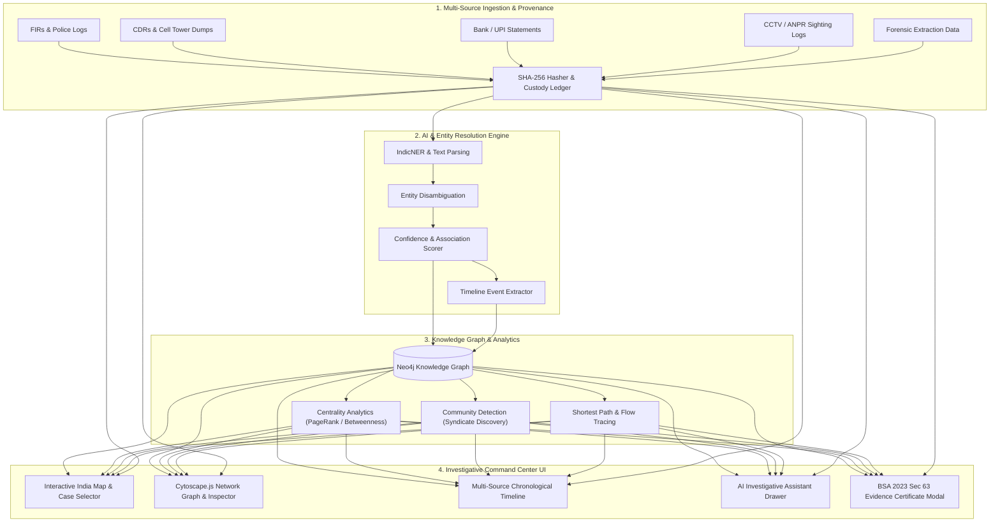

# KavachNet — System Architecture

> **PS #26189 — AI-Powered Criminal Network Analysis System**  
> Ministry of Home Affairs → National Crime Records Bureau (NCRB), Women Safety Division  
> Legal Compliance: **Bharatiya Sakshya Adhiniyam (BSA) 2023, Section 63** (Admissibility of Electronic Records)

---

## 1. High-Level Architecture Overview

KavachNet is structured as a **4-tier intelligence & evidentiary pipeline**:

---

## 2. Detailed Component Breakdown

### Tier 1: Multi-Source Ingestion & Evidence Provenance (`blockchain/` & `backend/ingestion/`)
- **Raw Evidence Ingestion**: Handles semi-structured and unstructured data feeds.
- **Tamper-Evident Hash Chain**: Every raw record is cryptographically hashed with SHA-256 upon entry. The record hash, timestamp, source device ID, and ingesting officer ID form an immutable ledger block.
- **BSA 2023 Compliance**: Supports automated Section 63 Electronic Evidence Certificate generation, cryptographically proving no record was altered post-ingestion.

### Tier 2: AI & Entity Resolution Engine (`ai/`)
- **Named Entity Recognition (NER)**: Extracts Persons, Locations, Organizations, Phone Numbers, Vehicle Registration Numbers, Bank Accounts, and Crime Typologies.
- **Entity Resolution & Deduplication**: Unifies aliases, multiple phone numbers belonging to one individual, and partial identifiers across different police stations.
- **Explainable Association Scoring**: Every edge connecting two entities carries an algorithmic confidence score (0–100%) and a human-readable justification (e.g., *"34 direct phone calls + co-located at Cell Tower ID 4812 on 12-Oct"*).

### Tier 3: Knowledge Graph & Network Analytics (`graph/`)
- **Dual-Storage Engine**:
  - **PostgreSQL**: Stores relational metadata, raw log text, custody records.
  - **Neo4j**: Stores entities (Nodes) and relationships (Edges).
- **Network Intelligence Algorithms**:
  - **Betweenness Centrality**: Flags potential coordinators / intermediaries.
  - **Degree & Eigenvector Centrality**: Identifies high-activity and influential nodes.
  - **Louvain Modularity**: Clusters entities into isolated sub-gangs or syndicates.

### Tier 4: Investigative Command Center (`frontend/`)
- **Zero-Learning-Curve UI**: Designed for frontline investigators and senior officers.
- **Context-Aware Visualizations**: Sizing nodes by centrality, color-coding by entity category, animating financial and call flows.
- **Conversational Assistant**: Allows investigators to query the case graph in natural language without writing SQL or Cypher queries.

---

## 3. Data Flow Progression

1. **Ingest**: File uploaded → Raw SHA-256 generated → Ingestion log created.
2. **Process**: NLP extracts entities & links → Confidence scores assigned.
3. **Graph**: Entities & relationships inserted into Neo4j graph structure.
4. **Analyze**: Centrality & community algorithms run, updating node metrics.
5. **Present**: Frontend retrieves graph payload via FastAPI REST API and renders interactive canvas.
